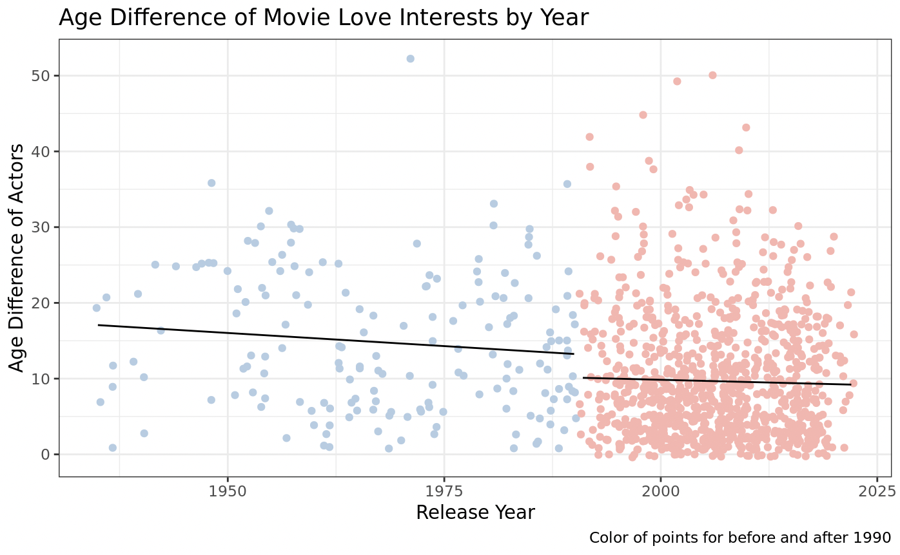

# tidy-tuesday-HW6

My visualization shows the age difference between love interests in movies by year. The first observation I wanted to make was if there would be an overall negative slope in the graph. The second observation was that I wanted to see if there was a change in the strength of the negative slope if I made a line of best fit from 1975 to 1990 and then a separate one from 1990 and 2023. I did see a clear change in the negative slope and also see that there seems to be less of an age difference between love interests from 1990 and beyond compared to 1975 to 1990. This aligned with my hypothesis that age differences would be more severe in a different time. This visualization is easy to interpret due to the color coding and detailed axes labels.

{width="564"}
